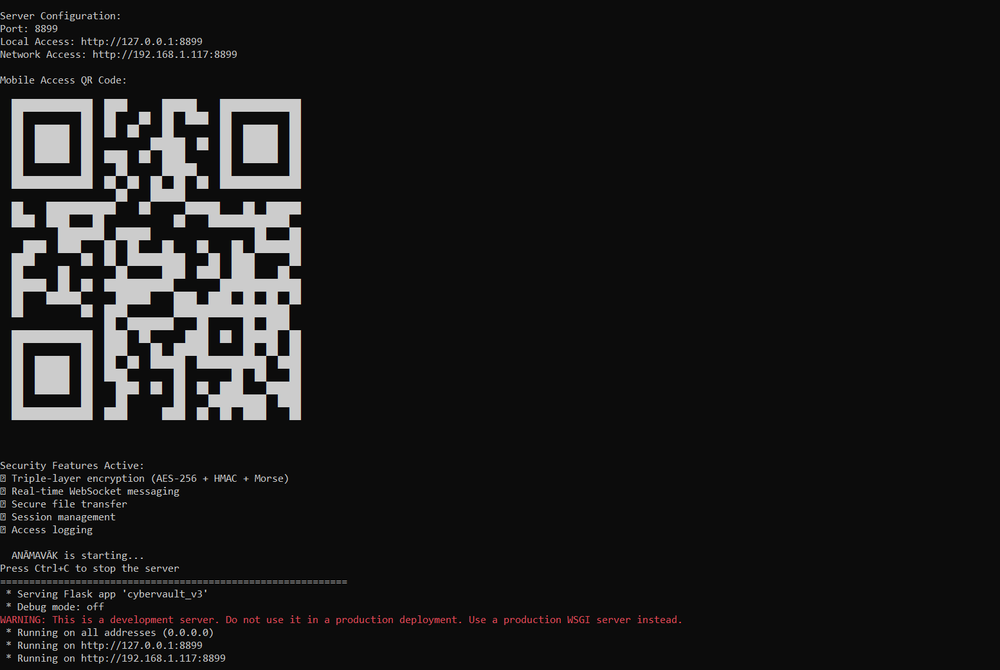
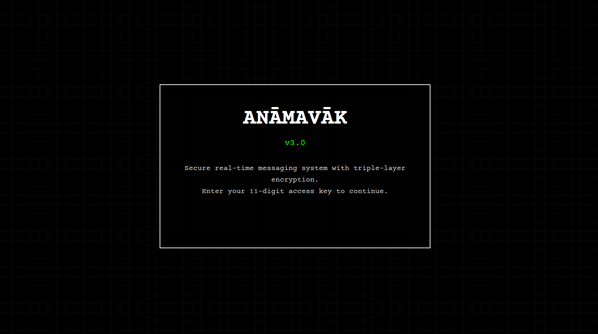
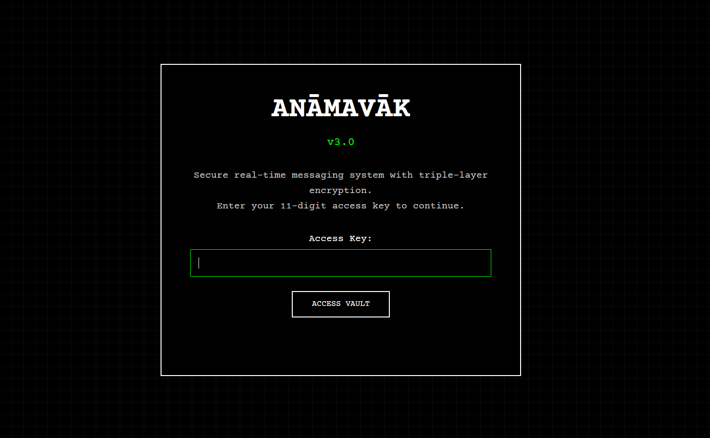
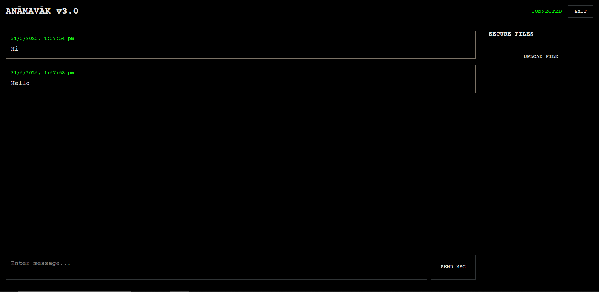
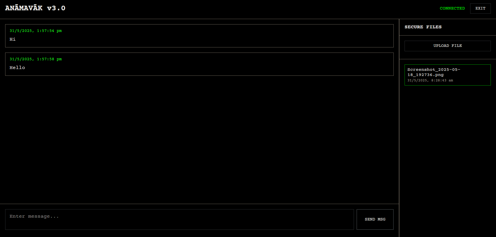
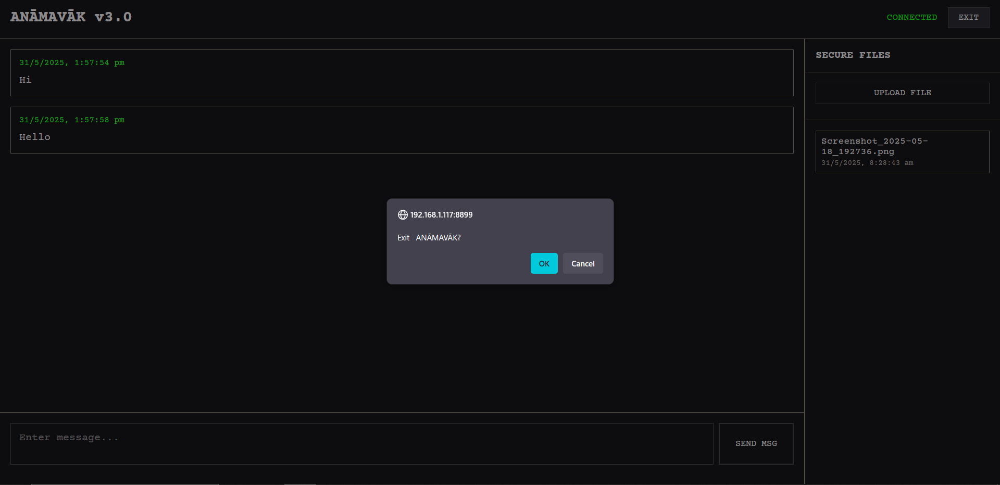

Here's the complete updated `README.md` with detailed usage instructions **and the six integrated screenshots**. Each step references an image from your `docs/` folder and explains the app visually and clearly.

---

# 🔐 TriCrypt

**Secure Real-Time Messaging & File Vault with Triple-Layer Encryption**


---

## 📖 Overview

**TriCrypt** is a privacy-first, real-time communication and file transfer system that leverages:

* 🔐 **Triple-layer encryption**: Morse Code → AES-256 → HMAC
* ⚡ **Real-time communication** via WebSockets
* 🧱 **Zero user accounts**: Just an 11-digit secure key
* 📂 **Encrypted file vault**
* 🖥️ **Retro terminal-style web interface**
* 📱 **Mobile access via QR code**

---

## ✨ Features

* 🔄 Real-time encrypted messaging
* 📎 Secure file uploads/downloads (up to 16MB)
* 🧠 Triple encryption: Morse obfuscation + AES + HMAC
* 🔑 11-digit numeric access keys
* 📜 IP/user-agent access logs
* 📷 QR code terminal output for mobile access
* 🧬 Session management

---

## 🧩 Tech Stack

* **Python 3.7+**
* **Flask** + **Flask-SocketIO**
* **SQLite3**
* **Cryptography** for AES-256
* **qrcode** for terminal QR
* HTML + CSS (Retro UI)

---

## 🧰 Installation

### 🪟 Windows

```bash
git clone https://github.com/yourusername/tricrypt.git
cd tricrypt

py -m venv venv
venv\Scripts\activate

pip install -r requirements.txt
python cybervault_v3.py
```

### 🐧 Linux / macOS

```bash
git clone https://github.com/yourusername/tricrypt.git
cd tricrypt

python3 -m venv venv
source venv/bin/activate

pip install -r requirements.txt
python3 cybervault_v3.py
```

### 🤖 Android (via Termux)

```bash
pkg install git python
git clone https://github.com/yourusername/tricrypt.git
cd tricrypt

pip install -r requirements.txt
python cybervault_v3.py
```

> 🔸 Use `termux-open-url` or a mobile browser to access the local IP shown with the QR code.

---

## 🚀 Starting the App

```bash
python cybervault_v3.py
```

You will be prompted to enter a **custom port** (press Enter for default: `5000`).
The terminal will then display:

* Localhost URL
* Network URL (for LAN access)
* 📱 QR code for quick mobile connection

---

## 🧭 How to Use TriCrypt (Visual Guide)

> 📂 Ensure the following images are located in your `docs/` folder:

| Step | Screenshot              | Filename          |
| ---- | ----------------------- | ----------------- |
| 1    | Starting the Server     | `start.png`       |
| 2    | Home Screen             | `homescreen.png`  |
| 3    | Entering the Secret Key | `secret_key.png`  |
| 4    | Messaging Interface     | `interface.png`   |
| 5    | Uploading Files         | `file_upload.png` |
| 6    | Logging Out             | `logout.png`      |

---

### 🧷 Step 1: Start the Server

Run the server and choose your port (e.g., `8899`).

```bash
python cybervault_v3.py
```

You'll see network URLs and a QR code for mobile access.



---

### 🏠 Step 2: Home Screen

Open your browser to `http://127.0.0.1:PORT` or your LAN IP.

Click the **ANĀMAVĀK** logo **7 times** to unlock the secret key panel.



---

### 🔑 Step 3: Enter Your Secret Key

Enter your **11-digit numeric key** (e.g., `12345678901`).
This is your **vault identifier and encryption key** — it must be the same across devices.



---

### 💬 Step 4: Real-Time Messaging Interface

You're now inside your encrypted vault. Start messaging in real-time!

* Messages are encrypted using your 11-digit key.
* Only users with the **same key** can view or send messages.



---

### 📁 Step 5: Upload a File

Use the right panel to **upload files** (max: 16MB).
Files are encrypted with AES-256 and stored securely.

* Click on files to download.
* Decryption happens locally with your vault key.



---

### 🔓 Step 6: Logout

Click **EXIT** in the top-right corner to logout.
This ends the session and clears the key from memory.



---

## 🔐 Encryption Model

```text
Plain Text
   ↓
Morse Code (Obfuscation)
   ↓
AES-256 Encryption (Key from 11-digit code)
   ↓
HMAC-SHA256 Integrity Check
```

All encryption happens before any transmission or storage.

---

## 📱 Mobile Access

Scan the terminal QR code with your phone.
Use your browser to open the vault and input your 11-digit key.
Enjoy full access to messaging and files.

---

## 🤝 Contributing

Pull requests welcome!

### Format code:

```bash
black cybervault_v3.py
```

### Run the app:

```bash
python cybervault_v3.py
```

---

## 📜 License

MIT License © 2025 \[Your Name]
TriCrypt — **Silence. Secured.**

---